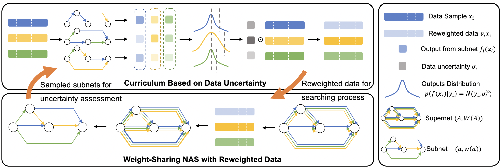

# Readme


## Introduction

The code of the ACM MM 2022 [paper](https://github.com/zhouyw16/curriculum-nas/raw/master/docs/Curriculum_NAS.pdf).

Curriculum-NAS: Curriculum Weight-Sharing Neural Architecture Search



The code is developed based on [XAutoDL](https://github.com/D-X-Y/AutoDL-Projects).


## Requirements

1. python >= 3.6

2. pytorch >= 1.9.0


## To Run the code

1. Clone the repository

```bash
git clone https://github.com/zhouyw16/curriculum-nas.git
```

2. Setup the environment

```bash
cd curriculum-nas
export TORCH_HOME=<The directory containing datasets and XAutoDL benchmarks>
```
For example, we need to make a directory, put **cifar-10-batches-py**, **cifar-100-python**, **ImageNet16** and **NATS-tss-v1_0-3ffb9-simple** into it, and export it as an environment variable TORCH_HOME.

The cifar10 and cifar100 datasets can be automatically downloaded. The imagenet dataset needs to be maually downloaded from the official [website](https://image-net.org/download-images) and the benchmark files from the link provided in code repository [NATS-Bench](https://github.com/D-X-Y/NATS-Bench).

3. Modify the XAutoDL module
```bash
pip install xautodl
```

Before running the code, it is necessary to add/modify some specific functions in xautodl library. Generally, the path of the files modified below is /usr/lib/python/site-packages/xautodl. A easy way is to jump to the definition of the following functions with the help of your IDE.

```python
# Modify: xautodl/utils/evaluation_utils.py
def obtain_accuracy(output, target, topk=(1,)):
    """Computes the precision@k for the specified values of k"""
    maxk = max(topk)
    batch_size = target.size(0)

    _, pred = output.topk(maxk, 1, True, True)
    pred = pred.t()
    correct = pred.eq(target.view(1, -1).expand_as(pred))

    res = []
    for k in topk:
        correct_k = correct[:k].reshape(-1).float().sum(0, keepdim=True)
        res.append(correct_k.mul_(100.0 / batch_size))
    return res

# Modify: xautodl/procedures/optimizers.py
def get_optim_scheduler(parameters, config, two_criterion=False):
    assert (
        hasattr(config, "optim")
        and hasattr(config, "scheduler")
        and hasattr(config, "criterion")
    ), "config must have optim / scheduler / criterion keys instead of {:}".format(
        config
    )
    if config.optim == "SGD":
        optim = torch.optim.SGD(
            parameters,
            config.LR,
            momentum=config.momentum,
            weight_decay=config.decay,
            nesterov=config.nesterov,
        )
    elif config.optim == "RMSprop":
        optim = torch.optim.RMSprop(
            parameters, config.LR, momentum=config.momentum, weight_decay=config.decay
        )
    else:
        raise ValueError("invalid optim : {:}".format(config.optim))

    if config.scheduler == "cos":
        T_max = getattr(config, "T_max", config.epochs)
        scheduler = CosineAnnealingLR(
            optim, config.warmup, config.epochs, T_max, config.eta_min
        )
    elif config.scheduler == "multistep":
        scheduler = MultiStepLR(
            optim, config.warmup, config.epochs, config.milestones, config.gammas
        )
    elif config.scheduler == "exponential":
        scheduler = ExponentialLR(optim, config.warmup, config.epochs, config.gamma)
    elif config.scheduler == "linear":
        scheduler = LinearLR(
            optim, config.warmup, config.epochs, config.LR, config.LR_min
        )
    else:
        raise ValueError("invalid scheduler : {:}".format(config.scheduler))

    if config.criterion == "Softmax":
        criterion = torch.nn.CrossEntropyLoss()
        w_criterion = torch.nn.CrossEntropyLoss(reduction='none')
    elif config.criterion == "SmoothSoftmax":
        criterion = CrossEntropyLabelSmooth(config.class_num, config.label_smooth)
        w_criterion = CrossEntropyLabelSmooth(config.class_num, config.label_smooth, reduction='none')
    else:
        raise ValueError("invalid criterion : {:}".format(config.criterion))
    if two_criterion:
        return optim, scheduler, criterion, w_criterion
    return optim, scheduler, criterion

# Add: xautodl/models/cell_searchs/generic_model.py/class GenericNAS201Model
    def return_rank(self, arch):
        archs = Structure.gen_all(self._op_names, self._max_nodes, False)
        pairs = [(self.get_log_prob(a), a) for a in archs]
        sorted_pairs = sorted(pairs, key=lambda x: -x[0])
        n = len(sorted_pairs)
        for i, pair in enumerate(sorted_pairs):
            p, a = pair
            if arch == a.tostr():
                return i, n
        return -1, n

```


4. Run

```bash
CUDA_VISIBLE_DEVICES=0 python search_ws.py --dataset cifar10 --data_path $TORCH_HOME --algo darts-v1 --rand_seed 777 --subnet_candidate_num 5
```

The gpu device can be selected by setting the index of CUDA_VISIBLE_DEVICES. 

Other running commands can refer to the beginning of **search_ws.py**.

5. Batch Run
```bash
bash run-ws.sh
```


## Cite
Please cite our paper as follows if you find our work useful:
```
To be supplemented later.
```